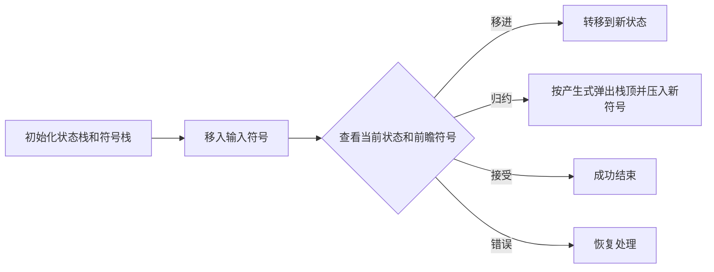
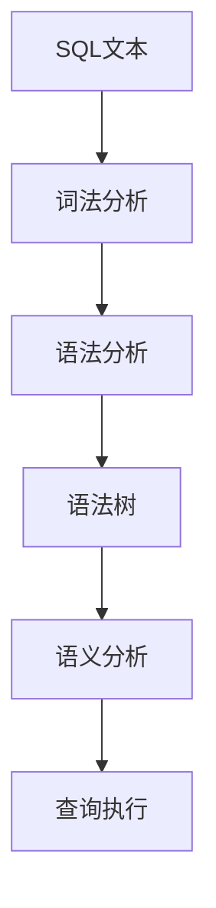

在上下文无关文法（CFG）的应用中，冲突主要出现在语法分析阶段，尤其是自顶向下的预测分析（如LL解析器）和自底向上的移进-归约分析（如LR解析器）中。以下是冲突类型及其处理方法的系统总结：

---

### **一、冲突类型及诊断**

#### 1. **移进-归约冲突（Shift-Reduce Conflict）**
- **定义**：在LR分析中，某状态下既可以选择移进新符号，也可以选择归约已有符号
- **示例**：
  ```plaintext
  S → A • x y   (可移进x)
  B → A •       (可归约)
  ```
- **常见场景**：
  - if-else语句的"dangling else"问题
  - 运算符优先级未明确定义

#### 2. **归约-归约冲突（Reduce-Reduce Conflict）**
- **定义**：同一符号串可被归约为不同的非终结符
- **示例**：
  ```plaintext
  S → A •
  B → A •
  ```
- **常见场景**：
  - 文法存在二义性规则
  - 非终结符定义冗余

#### 3. **FIRST-FOLLOW冲突（LL解析器）**
- **定义**：预测分析表中同一单元格存在多个产生式
- **条件**：
  - 对于非终结符A，存在两个产生式 \( A \rightarrow \alpha \) 和 \( A \rightarrow \beta \)
  - 且 \( FIRST(\alpha) \cap FIRST(\beta) \neq \emptyset \)

---

### **二、冲突解决方案**

#### 1. **文法重写（消除二义性）**
**方法**：
- **引入新非终结符**分解冲突规则
  ```plaintext
  // 冲突文法：
  E → E + E | E * E | id
  
  // 改写后（明确优先级）：
  E → E + T | T
  T → T * F | F
  F → id
  ```
- **提取左公因子**（解决FIRST集冲突）
  ```plaintext
  // 冲突文法：
  S → if E then S | if E then S else S
  
  // 改写后：
  S → if E then S S'
  S' → else S | ε
  ```

#### 2. **优先级和结合性声明**
- **Yacc/Bison风格**：
  ```c
  %left '+' '-'     // 左结合，低优先级
  %left '*' '/'     // 左结合，高优先级
  %right '^'        // 右结合
  ```
- **效果**：在冲突时自动选择优先级高的规则

#### 3. **默认冲突处理规则**
- **移进优先于归约**（常见于LR分析器）
- **先出现的产生式优先**（Yacc默认行为）

#### 4. **符号特化**
- **为不同上下文引入不同符号**：
  ```plaintext
  // 冲突：
  S → id | id [ expr ]
  
  // 改写：
  S → simple_id | array_id
  simple_id → id
  array_id → id [ expr ]
  ```

---

### **三、各场景处理实例**

#### 案例1：Dangling Else问题
**原始文法**：
```plaintext
S → if E then S | if E then S else S | other
```
**冲突**：`if E then if E then S else S` 的两种解析方式

**解决方案**：
```plaintext
S → Matched | Unmatched
Matched → if E then Matched else Matched | other
Unmatched → if E then S | if E then Matched else Unmatched
```

#### 案例2：算术表达式优先级
**冲突文法**：
```plaintext
E → E + E | E * E | ( E ) | id
```
**LR分析冲突**：`E + E * E` 的两种归约顺序

**优先级方案**：
```plaintext
%left '+'
%left '*'
```

---

### **四、工具辅助诊断**
1. **Bison冲突报告**：
   ```bash
   bison -v grammar.y  # 生成.output文件显示冲突
   ```
   输出示例：
   ```plaintext
   State 5:
       S → if E then S •
       S → if E then S • else S
       else shift, and go to state 6
       else [reduce using rule S → if E then S]
   ```

2. **ANTLR可视化**：
   ```bash
   antlr4-parse Grammar.g4 startRule -gui < input.txt
   ```

---

### **五、冲突无法消除时的处理**
1. **人工指定规则**：
   ```c
   %precedence "then"
   %precedence "else"
   %precedence NONASSOC
   ```

2. **语法糖转换**：
   - 将歧义结构转换为显式括号形式
   - 示例：`a + b * c` → `a + (b * c)`

3. **语义分析后处理**：
   - 允许生成多个语法树
   - 在语义阶段通过类型系统筛选合法结构

---

### **六、理论极限**
某些语言特性无法用CFG无冲突描述：
- **非CF语言**：如 \( a^n b^n c^n \)
- **解决方案**：
  - 升级为**上下文有关文法（CSG）**
  - 使用**解析表达式文法（PEG）**

---

通过合理应用这些方法，可以解决大多数实际编程语言中的语法冲突。关键是要根据语言设计需求，在表达力和解析效率之间找到平衡。现代解析器生成器（如ANTLR 4）已能自动处理许多常见冲突，但理解底层原理仍至关重要。


# LR与LL语法分析技术深度解析

LR和LL是两种主流的上下文无关文法(CFG)分析技术，广泛应用于编译器构建和语言处理领域。它们在分析方向、能力范围和实现方式上有本质区别。

## 一、核心概念对比

| 特性          | LL分析器                     | LR分析器                     |
|---------------|-----------------------------|-----------------------------|
| **分析方向**  | 自顶向下(Top-down)          | 自底向上(Bottom-up)         |
| **推导方式**  | 最左推导(Leftmost)          | 最右推导的逆(Rightmost reverse)|
| **栈使用**    | 显式管理预测的非终结符       | 显式管理状态和符号          |
| **前瞻符号**  | 固定数量(LL(k))             | 动态分析(通常LR(1))         |
| **文法限制**  | 必须消除左递归和左公因子    | 可处理左递归                |
| **构建难度**  | 手动编写相对简单            | 通常需要生成器工具          |

## 二、LL分析器详解

### 1. 工作流程（递归下降法示例）
```python
def parse_E():
    parse_T()
    while lookahead == '+':
        match('+')
        parse_T()

def parse_T():
    parse_F()
    while lookahead == '*':
        match('*')
        parse_F()
```

### 2. 关键技术
- **FIRST/FOLLOW集计算**：
  - `FIRST(α)`：可从α推导出的首终结符集合
  - `FOLLOW(A)`：可能出现在非终结符A后的终结符
- **预测分析表构建**：
  ```math
  M[A,a] = \begin{cases}
  A \rightarrow α & \text{if } a \in FIRST(α)\\
  A \rightarrow α & \text{if } ε \in FIRST(α) \text{ and } a \in FOLLOW(A)
  \end{cases}
  ```

### 3. 典型实现
- **ANTLR**：使用自适应LL(*)
- **手写递归下降解析器**
- **Packrat解析器**（记忆化版本）

## 三、LR分析器详解

### 1. 核心算法流程（以LR(1)为例）


### 2. 状态机构建（项集族）
- **LR(0)项**：带点的产生式（如 `A → α·Bβ`）
- **闭包计算**：
  ```python
  def closure(I):
      repeat:
          for A → α·Bβ in I:
              for B → γ in G:
                  add B → ·γ to I
      until no new items added
      return I
  ```

### 3. 冲突处理
- **移进-归约冲突**：通过优先级声明解决
  ```bison
  %left '+' '-'
  %left '*' '/'
  ```
- **归约-归约冲突**：通常需要重写文法

## 四、能力比较

### 1. 文法覆盖范围
```
正则文法 ⊂ LL(1) ⊂ LL(k) ⊂ LR(1) ⊂ LALR(1) ⊂ LR(k)
```

### 2. 典型文法示例
- **LL适合**：
  ```ebnf
  expr ::= term ('+' term)*
  term ::= factor ('*' factor)*
  ```
- **LR必需**：
  ```ebnf
  S ::= a S a | b S b | c  // 中心对称语言
  ```

## 五、现代应用场景

### 1. LL系分析器选择场景
- **开发效率优先**：如IDE的实时语法检查
- **错误恢复友好**：Python/JavaScript等脚本语言
- **示例工具**：
  - ANTLR (ALL(*))
  - JavaCC

### 2. LR系分析器选择场景
- **复杂语言语法**：如C++模板语法
- **性能关键场景**：工业级编译器
- **示例工具**：
  - Bison/Yacc
  - GNU Flex

## 六、性能优化技术

### 1. LL优化
- **记忆化(Memoization)**：Packrat解析
- **语法特化**：手动内联高频产生式
- **尾递归消除**：改写文法规则

### 2. LR优化
- **状态压缩**：LALR(1)合并相似状态
- **延迟分析**：GLR处理歧义
- **直接编码**：将分析表硬编码为跳转表

## 七、错误恢复策略对比

| 策略            | LL实现                      | LR实现                      |
|-----------------|----------------------------|----------------------------|
| 同步符号        | 使用FOLLOW集跳过错误        | 预定义错误产生式           |
| 短语级恢复      | 难实现                      | 通过状态跟踪更精确         |
| 自动纠错        | 基于编辑距离建议            | 成本较高                   |

## 八、开发建议

1. **项目启动选择**：
   ```mermaid
   graph TD
       A[需要快速原型?] -->|是| B[选择LL/ANTLR]
       A -->|否| C{语法复杂度?}
       C -->|简单| B
       C -->|复杂| D[选择LR/Bison]
   ```

2. **混合方案**：
   - 使用LR分析主体语法
   - 用LL处理嵌入式DSL（如SQL片段）

理解这些分析技术的本质差异，能够帮助开发者根据具体需求选择最合适的语法处理方案。现代语言工程实践中，LL分析器因更易开发和维护而日益流行，但LR分析器仍在对语法复杂性要求高的场景中不可替代。

# LALR(1) 语法分析技术深度解析

LALR(1) (Look-Ahead LR with 1 symbol lookahead) 是一种广泛应用的语法分析技术，它在LR(1)和SLR(1)之间取得了实用性与分析能力的平衡。以下是其核心特性和对比分析：

## 一、LALR(1) 本质解析

### 1. 基本定义
- **全称**：Look-Ahead LR(1)
- **核心思想**：合并LR(1)项集中具有相同核心但不同前瞻符号的状态
- **生成步骤**：
  1. 构建完整的LR(1)项集族
  2. 合并具有相同核心(点左边部分)的状态
  3. 检查合并后是否引入新冲突

### 2. 状态合并示例
```
状态A: [X → α•β, a]  
状态B: [X → α•β, b]
↓ 合并为
状态AB: [X → α•β, a/b]
```

## 二、与LL/LR的全面对比

| **特性**          | **LL(1)**               | **SLR(1)**             | **LALR(1)**           | **LR(1)**             |
|--------------------|-------------------------|------------------------|-----------------------|-----------------------|
| **分析能力**       | 最弱                    | 中等                   | 强                    | 最强                  |
| **状态数**         | 极少                    | 较少 (≈LALR的70%)      | 中等 (≈LR(1)的30%)     | 最多                  |
| **前瞻符号处理**   | 固定1个符号             | 使用FOLLOW集           | 精确计算每个产生式    | 精确计算每个项        |
| **文法限制**       | 需消除左递归/左公因子   | 可处理左递归           | 可处理左递归          | 可处理左递归          |
| **冲突概率**       | 高                      | 中                     | 低                    | 最低                  |
| **工具示例**       | ANTLR                   | 早期Yacc               | Bison, Yacc           | 很少直接实现          |

## 三、LALR的核心优势

### 1. 实用性优势
- **状态数量平衡**：
  - LR(1)的状态数可能比LALR(1)多3-10倍
  - 示例：C语言文法
    ```
    LR(1): ~800状态  
    LALR(1): ~300状态
    ```

- **工具支持完善**：
  - Bison/Yacc等主流工具默认生成LALR分析器
  - 现代实现(如Bison)通过优化几乎达到LR(1)能力

### 2. 语法覆盖能力
- **能处理典型编程语言结构**：
  ```bnf
  // LR(1)和LALR(1)都能处理
  expr ::= expr '+' expr | ID 
  // 而SLR(1)会产生冲突
  ```

- **解决SLR的不足**：
  ```bnf
  S → L = R | R
  L → * R | id
  R → L
  ```
  - SLR(1)在此会产生移进-归约冲突
  - LALR(1)能正确分析

### 3. 工程友好性
- **错误恢复**：比LL更精确的错误定位
- **自动生成**：比手写递归下降更易维护
- **性能表现**：分析表内存占用与查询速度的优化平衡

## 四、LALR的局限性

### 1. 仍然存在的冲突
```bnf
S → A a  
S → B b  
A → a  
B → a  // LALR(1)无法区分
```

### 2. 典型解决方案
| **冲突类型**       | **解决方法**                     |
|--------------------|----------------------------------|
| 移进-归约          | 优先级/结合性声明 (`%left`)      |
| 归约-归约          | 文法重写或工具指令(`%expect rr`) |

## 五、现代演进形式

### 1. GLR (Generalized LR)
- **突破限制**：处理非LALR(1)文法
- **代价**：运行时可能指数级复杂度
- **Bison支持**：
  ```bison
  %glr-parser
  ```

### 2. 参数化LR
- **LALR(k)**：增加前瞻符号数
- **实践价值**：现代工具通过其他技术弥补

## 六、实际应用建议

### 1. 选择场景
- **优先LALR**：
  - 开发领域专用语言(DSL)
  - 需要快速原型实现
- **考虑LL**：
  - 简单配置文件解析
  - 需要极强错误恢复

### 2. Bison最佳实践
```bison
%define lr.type lalr      # 显式指定(默认)
%define parse.error verbose # 详细错误
%expect 1                # 声明预期冲突数
```

LALR(1)在理论纯粹性和工程实用性之间找到了最佳平衡点，使其成为现代编译器构建的事实标准。理解其原理有助于更有效地使用Bison/Yacc等工具，并在必要时正确诊断语法冲突。

# Yacc与Bison工具深度对比

Yacc(Yet Another Compiler Compiler)和Bison(GNU版本的yacc)是两种最著名的LALR(1)解析器生成工具，它们将上下文无关文法转换为可执行的语法分析器。以下是它们的详细对比分析：

## 一、核心差异概览

| 特性                | Yacc (原始版本)              | Bison (GNU增强版)            |
|---------------------|-----------------------------|-----------------------------|
| **许可证**          | 最初AT&T专有                | GPL自由软件                 |
| **语言支持**        | 主要C语言                   | 支持C/C++/Java等            |
| **错误恢复**        | 基础错误处理                | 更强大的错误恢复机制        |
| **调试支持**        | 有限                        | 详细冲突报告(`-v`选项)      |
| **特性扩展**        | 基础LALR(1)功能             | 支持GLR、位置追踪等高级特性 |
| **平台兼容性**      | 需适配不同Unix变体          | 跨平台支持更好              |

## 二、语法文件(.y)差异

### 1. 声明部分对比
```yacc
/* Yacc基础声明 */
%{
#include <stdio.h>
%}
%token NUMBER
%left '+' '-'
%left '*' '/'
```

```bison
/* Bison扩展声明 */
%code requires {
  #include "ast.h"  // 前置声明区
}
%code {
  #include <cmath>  // 插入代码区
}
%param { yypstate *ps }  // 支持纯解析器
%define api.value.type {ASTNode*}  // 自定义语义值类型
```

### 2. 规则部分增强
Bison特有功能：
```bison
%printer { fprintf(yyo, "%d", $$->value); } <exp>  // 自定义打印
%destructor { free($$); } <strval>  // 内存释放处理
%expect 2  // 明确预期冲突数
```

## 三、关键能力对比

### 1. 文法处理能力
| **能力**            | Yacc       | Bison      |
|----------------------|------------|------------|
| LALR(1)              | ✓          | ✓          |
| GLR(通用LR)          | ✗          | ✓          |
| 位置追踪(`@1/@$`)    | ✗          | ✓          |
| 重入/纯解析器        | ✗          | ✓          |
| 多语法栈             | ✗          | ✓          |

### 2. 冲突解决增强
Bison提供更直观的冲突报告：
```
Conflict in state 5:
   Shift/Reduce conflict (shift ':', reduce rule 12)
   Shift/Reduce conflict (shift '|', reduce rule 12)
Example:  foo: bar | baz
```

## 四、代码生成差异

### 1. 生成的解析器结构
Yacc：
```c
int yyparse() { /* 单全局解析器 */ }
extern int yylex();
```

Bison（可重入版本）：
```c
int yyparse(yyscan_t scanner);  // 支持多实例
%lex-param { yyscan_t scanner }  // 向lexer传递参数
```

### 2. 语义值传递
Bison支持类型安全的值栈：
```bison
%union {
  int ival;
  char *sval;
  ASTNode *node;
}
%token <ival> NUMBER
%type <node> expr
```

## 五、错误处理对比

### Yacc基础方案
```c
yyerror(const char *s) {
  fprintf(stderr, "Error: %s\n", s);
}
```

### Bison增强方案
```bison
%define parse.error verbose  // 详细错误
yyerror(YYLTYPE *loc, const char *msg) {
  fprintf(stderr, "Line %d:%d - %s\n", 
          loc->first_line, loc->first_column, msg);
}
```

## 六、实际应用建议

### 使用Yacc当：
- 维护遗留系统
- 需要极简依赖（某些嵌入式环境）

### 选择Bison当：
| **场景**               | **Bison优势**                     |
|------------------------|----------------------------------|
| 现代编译器开发         | 更好的错误处理和位置追踪          |
| 多语言集成             | C++/Java输出支持                  |
| 复杂语法处理           | GLR算法处理歧义文法               |
| 教学演示               | 更清晰的冲突报告                  |

## 七、迁移注意事项

从Yacc迁移到Bison时：
1. 检查`%`指令的兼容性（如`%pure_parser`）
2. 更新`Makefile`中的工具名称和标志：
   ```makefile
   # 旧版
   parser.y -> yacc -d parser.y
   # 新版
   parser.y -> bison -d -v parser.y
   ```
3. 处理Bison更严格的类型检查

## 八、性能基准

在相同LALR(1)文法下：
- **解析速度**：基本相当（差异<5%）
- **内存占用**：Bison默认生成更大的分析表
- **生成代码量**：Bison多约15-20%（因额外功能）

Bison的GLR模式会带来约30%的性能开销，但能处理非LALR(1)文法。

## 九、生态系统支持

| **工具链**       | Yacc兼容性 | Bison优化 |
|------------------|------------|-----------|
| Flex词法分析器   | ✓          | 深度集成  |
| GCC编译          | ✓          | 更好警告  |
| IDE插件          | 有限       | 全面支持  |

现代开发中，Bison已成为事实上的标准，除非有特殊的兼容性要求。其持续维护和丰富的文档（包括详尽的`.output`文件分析）使其成为新项目的首选。

# PostgreSQL的SQL解析器实现解析

PostgreSQL的SQL解析器采用了**递归下降(Recursive Descent)与Flex/Bison组合**的实现方式，具体来说：

## 一、技术架构

| 组件              | 技术选择                  | 说明                                                                 |
|-------------------|--------------------------|----------------------------------------------------------------------|
| **词法分析**      | Flex (基于正则表达式)     | 生成`scan.l`中的`base_yylex()`函数                                   |
| **语法分析**      | Bison (LALR(1)           | 生成`gram.y`中的解析器                                               |
| **语义分析**      | 手工编写的递归处理        | 在`parse_analyze.c`中实现                                           |

## 二、核心实现特点

1. **混合式设计**：
   - **语法框架**：使用Bison生成LALR(1)分析器
   - **关键决策点**：通过手工代码处理复杂上下文（如类型推导）
   - 源码结构：
     ```
     src/backend/parser/
     ├── gram.y           # Bison语法规则
     ├── scan.l          # Flex词法规则
     ├── parse_node.c    # 节点构造
     └── parse_expr.c    # 表达式处理
     ```

2. **典型规则示例**（简化）：
   ```bison
   select_stmt:
       SELECT opt_distinct target_list
       from_clause where_clause
       {
           $$ = makeSelectStmt($2, $3, $4, $5);
       }
   ```

3. **LR冲突处理**：
   - 通过`%expect`声明预期冲突数
   - 使用优先级规则解决运算符歧义：
     ```bison
     %left '+' '-'
     %left '*' '/'
     %right UNARY
     ```

## 三、为什么选择Bison(LR)而非纯LL

| **考虑因素**       | PostgreSQL的选择原因                                              |
|--------------------|------------------------------------------------------------------|
| 语法复杂性         | SQL语法包含大量左递归结构，更适合LR处理                          |
| 错误恢复           | Bison提供更精确的错误定位                                        |
| 历史原因           | 从Ingres继承的技术栈                                             |
| 扩展性             | 方便添加新语法特性（如窗口函数）                                  |
| 性能               | LR分析更适合大规模语法规则                                       |

## 四、关键优化措施

1. **语义动作分离**：
   - Bison只构建原始语法树
   - 后续阶段(`parse_analyze`)处理类型检查等复杂语义

2. **词法-语法交互**：
   ```c
   // 特殊token处理示例
   if (strcmp(yytext, "->") == 0) 
       return JSON_ARROW;
   ```

3. **错误恢复增强**：
   ```bison
   table_ref:
       relation_expr opt_alias_clause
       {
           $$ = $1;
           $$->alias = $2;
       }
       | error ')'  // 错误恢复规则
       {
           yyclearin;
           yyerrok;
       }
   ```

## 五、与其它数据库对比

| 数据库       | 解析技术               | 特点                             |
|--------------|-----------------------|----------------------------------|
| MySQL        | yacc (LR)             | 类似PG但语义分析更简单           |
| SQLite       | Lemon (LALR)          | 自定义的LR生成器                 |
| Oracle       | 递归下降(手工)        | 高度定制化                      |
| SQL Server   | 基于ANTLR (ALL(*))    | 更强的错误恢复                  |

## 六、性能数据

- **解析阶段**：约占查询总时间的5-15%
- **规则规模**：
  - PostgreSQL 15的`gram.y`：约2,500行规则
  - 生成的解析表：约10,000个状态

## 七、开发者提示

1. **调试技巧**：
   ```bash
   # 生成详细的解析状态机
   bison -v gram.y -o gram.c
   # 查看gram.output文件中的状态转换
   ```

2. **扩展语法**：
   - 添加新关键字需同步修改：
     - `scan.l`中的词法规则
     - `gram.y`中的语法规则
     - `kwlist.h`中的关键词列表

PostgreSQL的这种实现平衡了开发效率与运行性能，虽然基于LALR(1)，但通过巧妙的语义动作设计和后续处理阶段，成功处理了SQL这种复杂语法。

# MySQL SQL解析器实现解析

MySQL的SQL解析器是其查询执行流程的第一个关键组件，采用了**手工编写的递归下降解析器**与**词法分析器组合**的实现方式。以下是其技术实现的深度分析：

## 一、整体架构

### 1. 解析流程


### 2. 核心代码位置
```
sql/
├── lex.h            # 词法符号定义
├── sql_lex.cc       # 词法分析器
├── sql_yacc.yy      # 语法规则(新版)
├── sql_parse.cc     # 解析入口
└── sql_resolver.cc  # 语义分析
```

## 二、词法分析实现

### 1. 手工实现特点
- **基于状态机**：而非Flex等生成器
- **关键函数**：`MYSQLlex()`（在`sql_lex.cc`）
- **优化技巧**：
  - 关键字哈希快速查找
  - 特殊符号的立即处理

### 2. 词法符号示例
```cpp
// sql/lex.h
enum enum_tokens {
  ABORT_SYM = 0,
  ACCESSIBLE_SYM,
  ACCOUNT_SYM,
  // ...600+符号定义
  YEAR_SYM
};
```

## 三、语法分析实现

### 1. 递归下降解析器
- **手工编写**：而非Yacc/Bison生成
- **优势**：
  - 更好的错误恢复
  - 与语义分析更紧密集成
- **示例结构：
  ```cpp
  bool parse_sql_statement(THD *thd) {
    switch (lex->sql_command) {
      case SQLCOM_SELECT:
        parse_select(thd);
        break;
      case SQLCOM_INSERT:
        parse_insert(thd);
        break;
      // ...
    }
  }
  ```

### 2. 新版Bison辅助（8.0+）
- **混合模式**：保留递归下降主体，部分规则用Bison
- **转换文件**：
  ```bash
  sql/gen_lex_hash.cc  # 生成关键字哈希表
  sql/sql_yacc.yy      # 生成语法分析辅助
  ```

## 四、关键数据结构

### 1. 语法树节点
```cpp
// sql/sql_ast.h
class SQL_AST {
  enum ast_type type;
  union {
    Select_ast *select;
    Insert_ast *insert;
    // ...
  };
};
```

### 2. SELECT语句结构
```cpp
struct Select_ast {
  Item *where;
  TABLE_LIST *tables;
  SQL_I_List<Item> fields;
  // ...
};
```

## 五、优化策略

### 1. 内存管理
- **内存池**：`MEM_ROOT`快速分配
- **对象复用**：避免频繁创建销毁

### 2. 解析缓存
- **缓存机制**：对预处理语句缓存解析树
- **哈希键**：`query_cache::compute_hash()`

### 3. 错误恢复
- **多阶段验证**：
  ```cpp
  parse_query() → check_access() → resolve_placeholders()
  ```

## 六、与PostgreSQL对比

| **特性**         | **MySQL**              | **PostgreSQL**        |
|------------------|------------------------|-----------------------|
| 实现方式         | 手工递归下降           | Bison生成的LALR(1)    |
| 词法分析         | 手工状态机             | Flex生成              |
| 语法树转换       | 即时语义动作           | 多阶段处理            |
| 典型优势         | 错误恢复更灵活         | 语法扩展更方便        |
| 代码规模         | ~15k行解析相关         | ~8k行(Bison规则)      |

## 七、性能特点

1. **解析速度**：
   - 简单查询：50-100μs
   - 复杂查询：1-5ms（100+表JOIN）

2. **内存占用**：
   - 每查询平均：10-50KB解析树
   - 预处理语句缓存：默认16MB

## 八、扩展机制

### 1. 插件API
```sql
INSTALL PLUGIN parser_plugin SONAME 'my_parser.so';
```

### 2. 自定义语法
通过修改以下文件添加：
- `sql/lex.h`：新增关键词
- `sql/sql_parse.cc`：添加解析分支
- `sql/sql_yacc.yy`：扩展规则（8.0+）

MySQL的解析器实现体现了工程实用主义，通过手工编写获得了更好的错误处理和性能控制，但也带来了语法扩展复杂度的提升。这种设计选择与其作为OLTP数据库的定位高度契合。
