# 关系数据库组成与架构

现代关系数据库管理系统(RDBMS)的架构设计经历了数十年的演进，形成了高度优化的体系结构。以下是主流关系数据库的典型架构组成及其工作原理：

## 核心功能组件
### 1. 核心架构分层

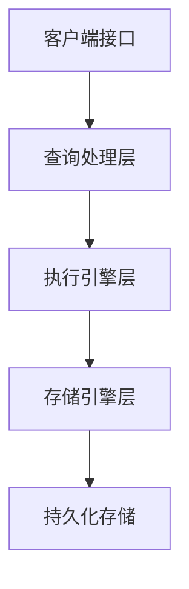

### 2. 详细架构组件

#### 2.1. 连接管理器
- **功能**：
  - 处理客户端连接（TCP/IP、Unix Socket等）
  - 连接池管理
  - 认证与授权
- **实现示例**：
  ```c
  // PostgreSQL后端进程创建
  PostmasterMain() {
      while (true) {
          int sock = accept(server_sock);
          fork_backend_process(sock);
      }
  }
  ```

#### 2.2. 查询处理流程

##### SQL解析与重写
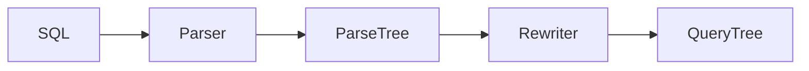

##### 查询优化器
- **成本模型**：
  ```python
  def estimate_cost(plan):
      cpu_cost = plan.operator_cost * cpu_weight
      io_cost = plan.data_size / disk_throughput
      return cpu_cost + io_cost
  ```
- **优化技术**：
  - 基于规则的优化(RBO)
  - 基于成本的优化(CBO)
  - 遗传算法(GA)

#### 2.3. 执行引擎实现

##### 火山模型(Volcano)
```cpp
class Operator {
public:
    virtual Tuple next() = 0;
    //...其他接口
};

class SeqScan : public Operator {
    Tuple next() override {
        return storage.get_next_tuple();
    }
};
```

##### 向量化执行
```sql
-- 每次处理一批数据
SELECT * FROM table WHERE col > 100;
-- 转换为：
for batch in table:
    result = batch[batch.col > 100]
    yield result
```

#### 2.4. 存储引擎架构

##### 缓冲池管理
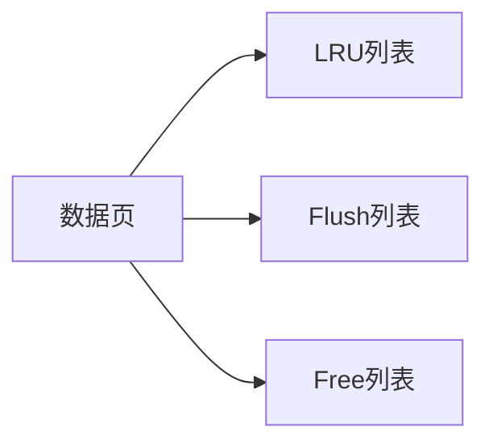

##### 事务处理(ACID实现)
- **原子性**：Undo Log
- **持久性**：Redo Log + WAL
- **隔离性**：MVCC + 锁机制
- **一致性**：约束检查

#### 2.5. 索引结构

| 索引类型 | 结构 | 适用场景 |
|----------|------|----------|
| B+树 | 平衡多路搜索树 | 通用索引 |
| 哈希 | 散列表 | 等值查询 |
| R树 | 空间索引 | GIS数据 |
| 倒排 | 词项-文档映射 | 全文检索 |

### 3. 主流数据库架构对比

#### 3.1. MySQL (InnoDB)
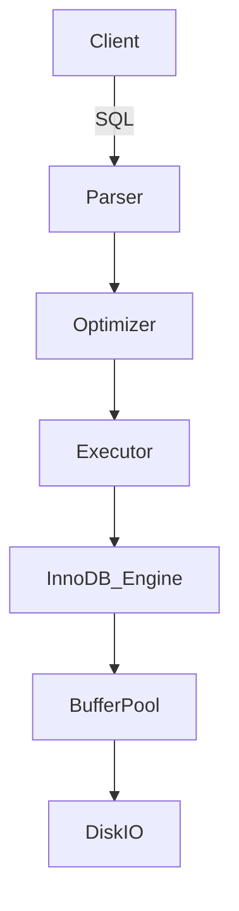

**特点**：
- 插件式存储引擎
- 多线程模型（线程池）
- 在线DDL支持

#### 3.2. PostgreSQL
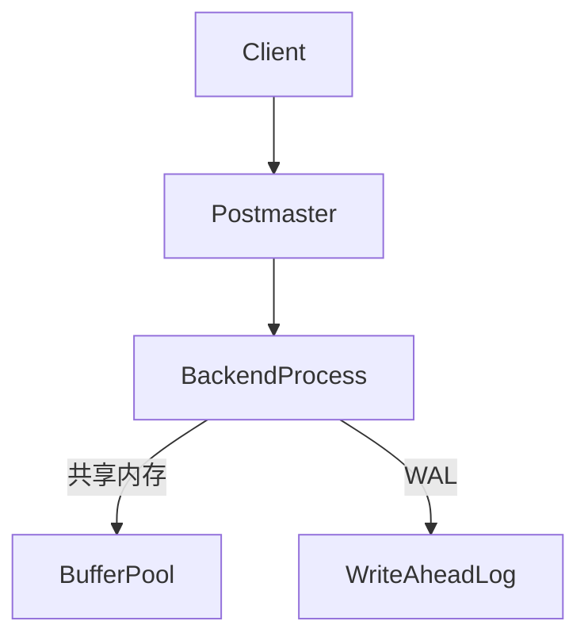

**特点**：
- 进程模型（非线程）
- 表空间管理
- 扩展系统（Extension）

#### 3.3. Oracle Database


**特点**：
- 实例+数据库分离
- ASM存储管理
- RAC集群架构

#### 3.4. SQL Server
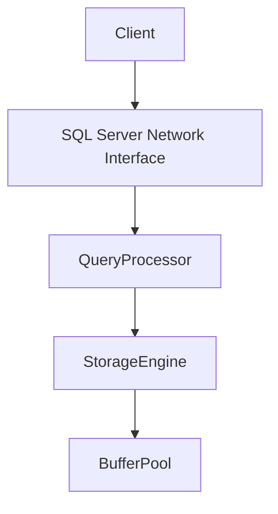

**特点**：
- Windows集成认证
- 列存储索引
- 内存OLTP支持

### 4. 现代演进趋势

#### 4.1. 云原生架构
- **计算存储分离**：
  ```mermaid
  graph LR
    ComputeNode -->|RDMA| StorageService
    ComputeNode -->|Log| MetadataService
  ```
- 代表：AWS Aurora, PolarDB

#### 4.2. 混合事务分析处理(HTAP)
- **行列混合存储**：
  ```sql
  -- 同一表支持行/列两种格式
  CREATE TABLE htap_table (...) 
  WITH (STORAGE_TYPE = HYBRID);
  ```
- 代表：TiDB, Oracle Exadata

#### 4.3. 多模数据库支持
- **统一引擎**：
  ```mermaid
  graph LR
    SQL -->|解析| QueryEngine
    JSON -->|解析| QueryEngine
    Graph -->|解析| QueryEngine
  ```
- 代表：Microsoft SQL Server, PostgreSQL

## 5.性能优化设计

### 5.1. 内存架构优化
- **缓冲池分区**：
  ```ini
  # MySQL配置
  innodb_buffer_pool_instances=8
  ```
- **列式缓存**：
  ```sql
  -- SQL Server列存储
  CREATE COLUMNSTORE INDEX idx ON table(col1,col2)
  ```

### 5.2. 并行查询执行
```sql
-- Oracle并行提示
SELECT /*+ PARALLEL(employees, 4) */ * FROM employees;
```

### 5.3. 智能预读策略
```cpp
// B+树预读算法
void btr_prefetch_children(block) {
    for (i = 0; i < 5; i++) {
        prefetch(block->children[i]);
    }
}
```

## 6. 高可用设计

### 6.1. 复制架构
| 类型 | 同步方式 | 代表实现 |
|------|----------|----------|
| 主从 | 异步 | MySQL Replication |
| 多主 | 同步 | Galera Cluster |
| 日志同步 | 半同步 | PostgreSQL Streaming Replication |

### 6.2. 分片策略
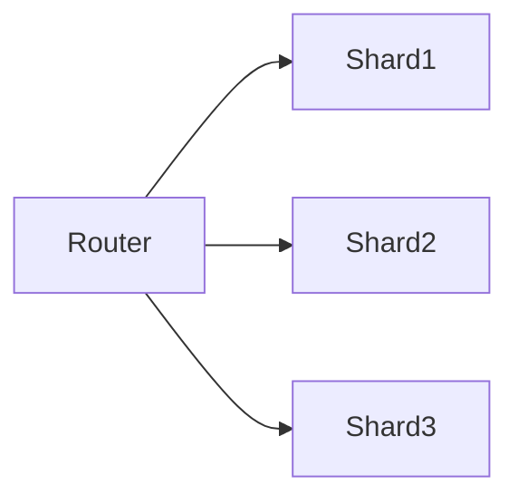

主流关系数据库架构虽然实现各有差异，但核心设计思想相通。未来发展趋势呈现：
1. 云原生与分布式
2. 硬件加速（GPU/FPGA）
3. 多模数据支持
4. 智能化运维

理解这些架构原理有助于：
- 数据库选型决策
- 性能问题诊断
- 应用优化设计
- 运维方案制定

## 架构形式
关系数据库服务器程序主要有两种架构形式，线程模式和进程模式，典型代表就是MySQL和PostgreSQL,下面从几个方面对比一下其特点和优缺点。

### 1. 基础架构对比

| 特性                | MySQL (InnoDB)                     | PostgreSQL                          |
|---------------------|------------------------------------|-------------------------------------|
| **并发模型**         | 多线程模型                         | 多进程模型                          |
| **连接处理方式**     | 线程池/每连接一线程                | 每连接一进程                        |
| **内存管理**         | 全局共享内存                       | 每个进程独立内存空间                |
| **典型进程/线程组成**| 主线程、IO线程、purge线程等        | postmaster主进程+backend子进程      |

## 2. 连接处理机制

### MySQL线程模型
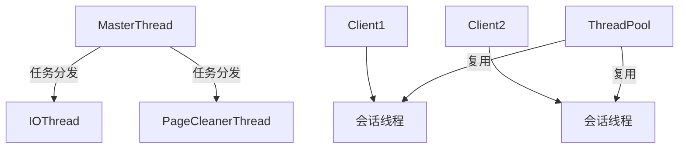

- **工作流程**：
  1. 客户端连接请求到达
  2. 从线程池分配或创建新线程
  3. 线程处理完请求后返回线程池

- **优势**：
  - 线程创建/销毁开销小
  - 上下文切换成本相对较低
  - 共享内存访问效率高

### PostgreSQL进程模型
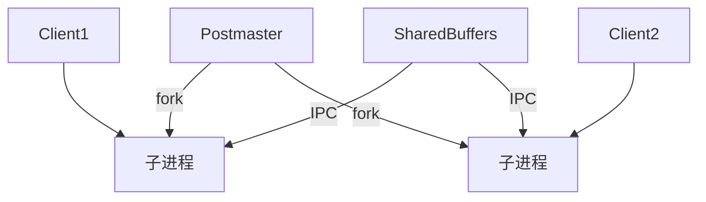

- **工作流程**：
  1. postmaster主进程监听连接
  2. 收到连接后fork子进程
  3. 子进程完全独立处理请求

- **优势**：
  - 进程隔离性好，单进程崩溃不影响整体
  - 避免多线程编程的复杂性
  - 更利于利用多核CPU

## 3. 内存管理对比

### MySQL内存架构
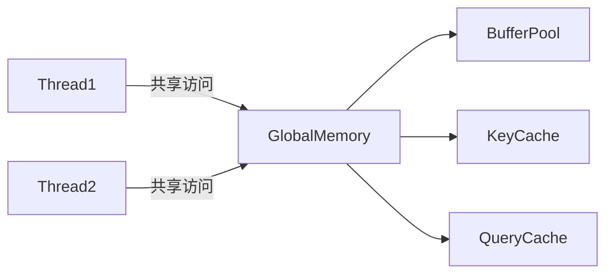

- **特点**：
  - 全局缓冲池（innodb_buffer_pool）
  - 线程间无需特殊通信机制
  - 存在锁竞争问题

### PostgreSQL内存架构
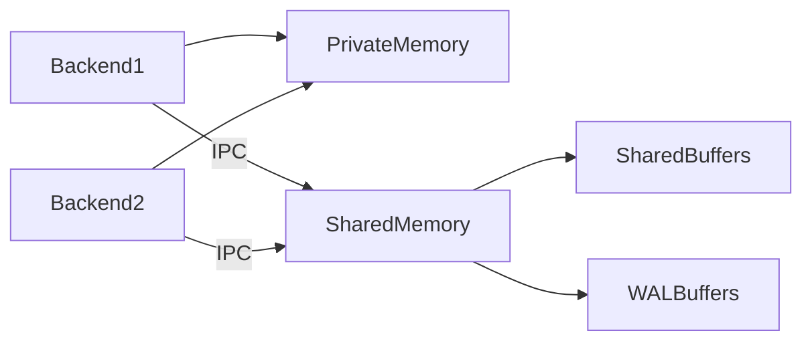

- **特点**：
  - 共享内存区（shared_buffers）
  - 每个backend有私有内存
  - 通过IPC机制通信

## 4. 性能特征对比

| 指标                | MySQL                          | PostgreSQL                     |
|---------------------|--------------------------------|--------------------------------|
| **连接建立速度**     | 快（线程池复用）              | 慢（进程fork开销）             |
| **高并发性能**       | 中等（锁竞争增加）            | 好（进程隔离减少竞争）         |
| **内存使用效率**     | 高（共享内存）                | 较低（进程独立内存）           |
| **CPU缓存利用率**    | 较好                          | 一般（进程切换导致缓存失效）   |
| **长连接场景**       | 表现优异                      | 内存增长明显                   |
| **短连接场景**       | 线程池优势明显                | fork开销影响大                 |

## 5. 典型应用场景

### MySQL线程模型适用场景
- Web应用高频短连接
- 连接数波动大的云环境
- 需要快速建立/释放连接的OLTP系统
- 内存资源有限的服务器

### PostgreSQL进程模型适用场景
- 复杂分析型查询（OLAP）
- 需要高稳定性的关键业务
- 连接相对持久的数据仓库
- 多核CPU利用率要求高的环境

## 6. 故障隔离对比

### MySQL线程模型风险


- 单个线程崩溃可能导致整个服务不可用
- 内存泄漏会影响所有连接
- 需要完善的异常处理机制

### PostgreSQL进程模型优势


- 单进程崩溃可由postmaster自动恢复
- 内存问题隔离性好
- 稳定性更高

## 7. 配置参数对比

### MySQL关键线程参数
```ini
# my.cnf
thread_handling=pool-of-threads
thread_pool_size=16
innodb_read_io_threads=4
innodb_write_io_threads=4
```

### PostgreSQL关键进程参数
```ini
# postgresql.conf
max_connections=100
superuser_reserved_connections=3
shared_buffers=4GB
work_mem=4MB
```

## 8. 现代演进趋势

### MySQL改进方向
- 增强线程池功能（8.0+）
- 减少全局锁争用
- 优化NUMA架构支持

### PostgreSQL改进方向
- 引入进程池（pgbouncer集成）
- 增强共享内存利用
- 实验性线程支持（并行查询）

两种架构各有优劣，实际选择应结合具体应用场景、硬件配置和运维能力综合考量。现代版本中两者的差距正在缩小，都通过不同方式弥补了原有架构的不足。	
